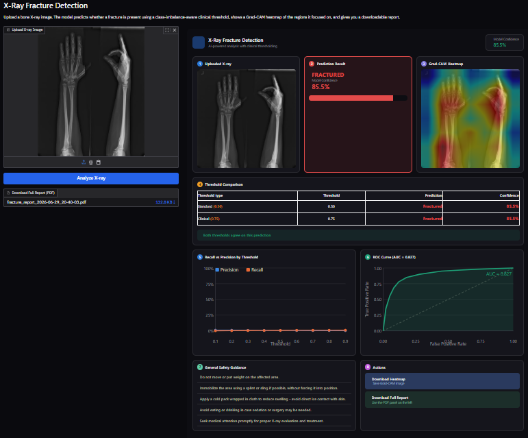

# 🦴 Bone Fracture Detection using Explainable AI

<p align="center">
  
</p>

<p align="center">


</p>

---

## 📌 Overview

Bone Fracture Detection is an Explainable AI web application that automatically detects fractures from X-ray images using a deep learning model based on **EfficientNetB0**.

Unlike traditional classification systems, this project also provides **Grad-CAM heatmaps** to explain which regions influenced the prediction, making the model more interpretable.

The application is deployed on **Hugging Face Spaces** using an interactive **Gradio** interface.

---

## 🚀 Live Demo

🔗 **Hugging Face**

https://huggingface.co/spaces/shaliniii/bone-fracture-detection

---

# ✨ Features

- 🦴 Bone Fracture Detection
- 🔥 Explainable AI using Grad-CAM
- 📊 Confidence Score
- 📈 Threshold Comparison
- 📄 Downloadable PDF Report
- 🌙 Modern Dark UI
- ⚡ Fast Inference
- ☁️ Hugging Face Deployment

---

# 🖥 Dashboard


---

# 🧠 Deep Learning Model

| Feature | Details |
|----------|---------|
| Model | EfficientNetB0 |
| Framework | TensorFlow / Keras |
| Image Size | 224 × 224 |
| Classes | Fractured / Non-Fractured |
| Explainability | Grad-CAM |

---

# 🛠 Tech Stack

- Python
- TensorFlow
- Keras
- OpenCV
- NumPy
- Matplotlib
- Gradio
- ReportLab

---

# 📂 Project Structure

```
Bone-Fracture-Detection-using-Explainable-AI
│
├── app.py
├── fracture_model_finetuned_v2.keras
├── requirements.txt
├── README.md
├── LICENSE
├── screenshots/
│     └── dashboard.png
└── .gitattributes
```

---

# ⚙ Installation

```bash
git clone https://github.com/Shalinikuu/Bone-Fracture-Detection-using-Explainable-AI.git

cd Bone-Fracture-Detection-using-Explainable-AI

pip install -r requirements.txt

python app.py
```

---

# 📈 Model Output

The application provides

- Fractured / Non-Fractured Prediction
- Confidence Score
- Grad-CAM Heatmap
- Threshold Comparison
- PDF Report

---

# 📷 Sample Workflow

1. Upload X-ray Image
2. Click **Analyze X-ray**
3. View Prediction
4. View Grad-CAM Heatmap
5. Download PDF Report

---

# 🔮 Future Improvements

- YOLO-based Fracture Localization
- Multi-Class Bone Detection
- DICOM Image Support
- Clinical Report Generation
- Mobile Application

---

# 👩‍💻 Author

**Shalini Kushwaha**

B.Tech Computer Science Engineering

GitHub:
https://github.com/Shalinikuu

Hugging Face:
https://huggingface.co/spaces/shaliniii/bone-fracture-detection

---

# 📄 License

This project is licensed under the MIT License.

---
